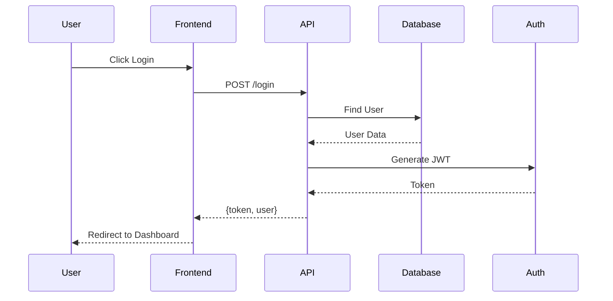
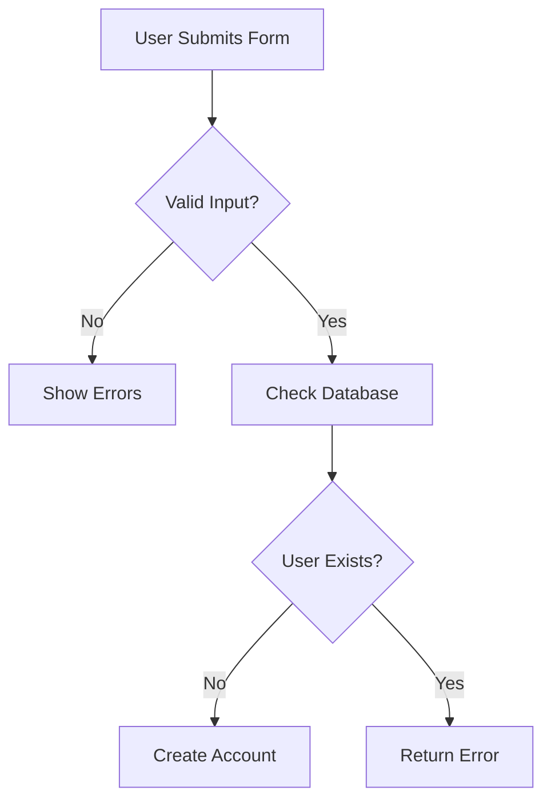
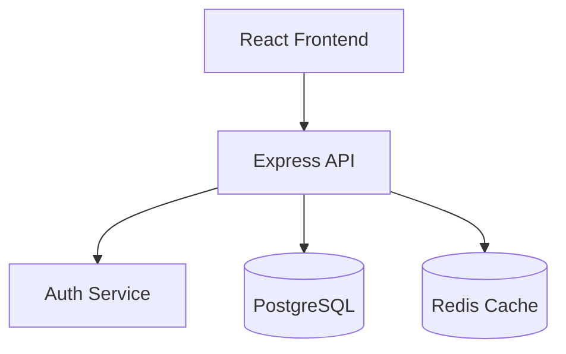
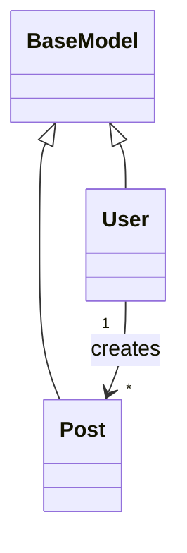

# OnboardAI - Intelligent Codebase Onboarding Assistant
## Requirements Specification

**Track**: AI for Learning & Developer Productivity  
**Focus**: Helping developers learn faster, work smarter, and become productive while understanding technology

---

## 1. Project Overview

### 1.1 Product Name
**OnboardAI** - Intelligent Codebase Onboarding Assistant

### 1.2 Vision Statement
Transform how developers learn codebases - from weeks of frustration to hours of guided exploration using AI-powered understanding.

### 1.3 Problem Statement

**The Learning Crisis in Software Development:**

Developers face massive **learning barriers** when joining new projects:
- **Learning Time**: 2-6 weeks to understand a new codebase before being productive
- **Knowledge Gaps**: Critical business logic and architecture patterns hidden across thousands of files
- **Inefficient Learning**: Developers waste 60% of onboarding time searching, not learning
- **Senior Developer Bottleneck**: Mentors spend 15-20 hours/week explaining "Where is X?" instead of building
- **Self-Directed Learning**: Impossible without clear guidance on what to learn first

**Impact on Learning & Productivity:**
- **$3,000-$15,000 lost** per developer during unproductive onboarding period
- **40% of new hires** struggle to contribute meaningfully in first month
- **70% of developer time** during onboarding is spent navigating, not learning concepts
- **Open-source learning curve** prevents 80% of potential contributors from participating

**Why Traditional Learning Methods Fail:**
1. ❌ Documentation is outdated or missing (60% of repos)
2. ❌ Code itself doesn't explain "why" or "how"
3. ❌ No structured learning path through codebase
4. ❌ Can't ask questions without bothering senior developers
5. ❌ No visual representation of architecture to build mental models

### 1.4 Target Users

**Primary**: Developers in active learning phases
- **New hires** joining engineering teams (weeks 1-8)
- **Junior developers** building foundational code understanding skills
- **Interns & freshers** learning professional codebases for first time
- **Self-taught programmers** exploring open-source projects

**Secondary**: Productivity-focused engineers
- **Senior developers** mentoring new team members
- **Open-source contributors** learning project structure before contributing
- **Code reviewers** understanding context quickly
- **Technical leads** assessing architecture of acquired/legacy systems

**Learning Personas:**
- **Visual Learners**: Need diagrams and flowcharts to understand structure
- **Question-Driven Learners**: Learn by asking "how does X work?"
- **Example-Based Learners**: Need to see code examples with explanations
- **Systematic Learners**: Want structured roadmap of what to learn in what order

### 1.5 Core Innovation: AI-Powered Learning Acceleration

OnboardAI combines **static code analysis** with **AI reasoning** to create an **intelligent learning companion** for developers:

**1. Understand**: Analyzes codebase structure using AST parsing
**2. Explain**: Uses LLM to explain concepts in clear, beginner-friendly language  
**3. Visualize**: Generates diagrams to help developers build mental models
**4. Guide**: Creates personalized learning roadmap through the codebase

**Key Differentiator**: We don't just answer questions - we **teach developers how to think about the codebase**.

**Alignment with "Learning & Developer Productivity" Track:**
- ✅ **Learning Assistant**: Explains code like a patient senior engineer
- ✅ **Productivity Tool**: Reduces onboarding from weeks to hours
- ✅ **Knowledge Organization**: Structures codebase knowledge logically
- ✅ **Skill Building**: Helps developers recognize architecture patterns
- ✅ **Clarity**: Simplifies complex codebases through visual explanations

---

## 2. Functional Requirements

### 2.1 Learning-Centric Repository Analysis

#### FR-2.1.1: GitHub Repository Input
**Priority**: CRITICAL  
**Learning Goal**: Help user start learning journey with any GitHub repository

- User provides GitHub repository URL (public or private)
- Support for:
  - Public repos: Zero-friction learning (no authentication needed)
  - Private repos: GitHub token for work/team repositories
  - Monorepos: Select specific project to focus learning on
- **Learning Enhancement**: Display repository context to help learner understand project domain
  - Stars, forks (indicates popularity/production usage)
  - Last commit date (indicates active vs. legacy project)
  - Primary language (sets learning expectations)
  - Project description (business context)

**Acceptance Criteria**:
- User pastes GitHub URL → System begins learning-optimized analysis
- System shows: "This is a React e-commerce project with 5K stars - popular production app"
- Helps learner contextualize what they're about to learn

#### FR-2.1.2: Intelligent Code Filtering for Learning
**Priority**: HIGH  
**Learning Goal**: Focus learner attention on important code, hide noise

- Clone repository to temporary storage
- **Smart filtering** optimized for learning:
  - **Include**: Source code that teaches concepts (`.js`, `.py`, `.tsx`, `.java`)
  - **Include**: Configuration that shows tech stack decisions (`package.json`, `Dockerfile`)
  - **Exclude**: Build artifacts, logs, dependencies (not valuable for learning)
  - **Highlight**: Entry points and key modules (where to start learning)
- **Learning Benefit**: Reduces cognitive load by showing only relevant code

**Acceptance Criteria**:
- 100MB repo → Filtered to 15MB of actual learning-relevant code
- System identifies: "3 entry points, 12 core modules, 45 utility files"

#### FR-2.1.3: Tech Stack Detection & Learning Context
**Priority**: CRITICAL  
**Learning Goal**: Help learner understand prerequisites and set learning expectations

- Auto-detect primary programming language(s) and frameworks
- **Generate Learning Context**:
  - "This is a full-stack JavaScript app using React + Express"
  - "Prerequisites: Understanding of async/await, REST APIs, React hooks"
  - "Estimated learning time: 4-6 hours for basics, 2-3 days for depth"
- Identify project type and learning implications:
  - Web app → "Focus on routing, state management, API integration"
  - API service → "Focus on endpoint structure, data models, middleware"
  - Library → "Focus on public API, usage patterns, extensibility"

**Acceptance Criteria**:
- Repo analyzed → Tech stack summary with learning prereqs shown
- Output: "React 18, Express 4, PostgreSQL | Prerequisites: JavaScript, basic SQL"

### 2.2 Static Code Analysis for Learning

#### FR-2.2.1: Abstract Syntax Tree (AST) Parsing
**Priority**: CRITICAL  
**Learning Goal**: Extract structured knowledge from code for teaching

- Parse source code into AST for each supported language
- **Supported languages (MVP)**: JavaScript/TypeScript, Python
- **Extract for learning**:
  - Function signatures → What capabilities exist
  - Class hierarchies → How code is organized
  - Import relationships → How modules depend on each other
  - Route definitions → What the app does from user perspective
  - Database models → What data the app manages

**Learning Application**:
- Teach: "This app has 3 main layers: Routes → Controllers → Database"
- Explain: "The User class inherits from BaseModel, adding authentication"

**Acceptance Criteria**:
- Parse 100 files → Extract all functions/classes with learning-relevant metadata
- Can answer: "What are the main capabilities of this app?"

#### FR-2.2.2: Dependency Mapping for Learning Paths
**Priority**: HIGH  
**Learning Goal**: Show learner how code flows and what to learn in what order

- Build **Learning-Oriented Dependency Graph**:
  - Which files are foundational (no dependencies) → Learn these first
  - Which files are high-level (many dependencies) → Learn these last
  - Critical path from entry point to core functionality → Essential learning route
- **Visual Learning Aid**: Dependency graph shows learning progression
- **Smart Recommendations**:
  - "Start with `models/User.js` (no dependencies)"
  - "Then learn `controllers/auth.js` (uses User model)"
  - "Finally explore `routes/api.js` (orchestrates everything)"

**Acceptance Criteria**:
- Generate learning path: Foundation → Core → Advanced
- Identify: "3 foundational modules, 8 core modules, 15 advanced modules"

#### FR-2.2.3: Entry Point Discovery
**Priority**: CRITICAL  
**Learning Goal**: Tell learner exactly where to start reading code

- Automatically detect application entry points:
  - **Web apps**: `index.js`, `main.js`, `app.js`, `server.js`
  - **Python**: `__main__.py`, `app.py`, `manage.py`
  - **Config-based**: Read `package.json` scripts for entry points
- **Learning Guidance**: Explain what each entry point does
  - "server.js: Starts the Express API server"
  - "index.js: React app root, renders to DOM"
  - "worker.js: Background job processor"

**Acceptance Criteria**:
- Repo analyzed → "Start your learning here: server.js (API entry) and App.jsx (UI entry)"
- Ranks entry points by learning importance

#### FR-2.2.4: Pattern Recognition for Learning
**Priority**: HIGH  
**Learning Goal**: Teach architectural patterns developers should understand

- Detect common patterns and explain their purpose:
  - **Authentication**: "This app uses JWT tokens for authentication - learn auth.js first"
  - **MVC Pattern**: "Code organized in Model-View-Controller - common web pattern"
  - **Middleware Pattern**: "Express uses middleware for request processing"
  - **Repository Pattern**: "Database access abstracted behind repositories"
- **Educational Value**: Helps developers recognize patterns in other codebases
- Tag files with patterns: `[Authentication]`, `[CRUD]`, `[Validation]`, `[Caching]`

**Acceptance Criteria**:
- Detects 5+ common patterns (auth, CRUD, middleware, etc.)
- Output: "This codebase demonstrates: MVC, Dependency Injection, Factory Pattern"

### 2.3 AI-Powered Learning Companion

#### FR-2.3.1: Natural Language Learning Interface
**Priority**: CRITICAL  
**Learning Goal**: Let learners ask questions the way they think

Developers learn by asking questions. OnboardAI answers like a patient tutor:

**Question Types Supported**:

**1. Factual Discovery** (Where/What)
- "Where is authentication handled?"
- "What database is being used?"
- "Where are the API endpoints defined?"

**2. Concept Explanation** (How/Why)
- "How does user login work?"
- "Why is Redis used here?"
- "How does this app handle errors?"

**3. Learning Guidance** (What should I learn)
- "What should I learn first in this codebase?"
- "What are the most important files?"
- "Show me the critical path from login to dashboard"

**4. Pattern Recognition** (Teach me the pattern)
- "Explain the authentication pattern"
- "How is the MVC pattern implemented?"
- "What design patterns are used?"

**5. Visual Learning** (Show me)
- "Draw the login flow"
- "Show me the database schema"
- "Visualize how components connect"

**Learning-Optimized Responses**:
- Start with high-level concept
- Provide specific code references
- Explain "why" not just "what"
- Suggest related concepts to learn next

**Acceptance Criteria**:
- Learner asks "How does login work?" → Gets 5-step explanation with code snippets
- Response includes: Concept → Implementation → Related Topics to Learn

#### FR-2.3.2: Educational Code Explanations (LLM-Powered)
**Priority**: CRITICAL  
**Learning Goal**: Explain code in beginner-friendly language

Use LLM (Gemini 1.5 Flash) to generate **tutorial-style explanations**:

**Teaching Approach**:
- Explain concepts assuming learner is junior developer
- Break complex flows into simple steps
- Use analogies when helpful
- Define technical terms in parentheses
- Highlight learning takeaways

**Example Response Format**:
```
Q: "How does authentication work?"

A: Authentication in this app follows a 3-step JWT pattern:

1. LOGIN REQUEST (auth.js:45-60)
   User sends email + password
   → Server checks against database
   → If valid, generates JWT token
   
   📚 Learning: JWT = JSON Web Token, a secure way to identify users
   
2. TOKEN VERIFICATION (middleware/auth.js:12-25)  
   On each request, app checks JWT token
   → Decodes token to get user ID
   → Fetches user from database
   
   📚 Learning: Middleware runs before route handlers
   
3. PROTECTED ROUTES (routes/api.js:30-50)
   Routes that need authentication use auth middleware
   → Example: /profile, /dashboard require login
   
   📚 Learning: This is the "middleware pattern" - common in Express

Next Learning Steps:
→ Read: middleware/auth.js (token verification)
→ Explore: How tokens are generated in auth.js
→ Advanced: Learn about JWT expiration and refresh tokens
```

**Acceptance Criteria**:
- Explanations are beginner-friendly (no unexplained jargon)
- Each explanation includes learning takeaways
- Response suggests next learning steps

#### FR-2.3.3: Visual Learning Aids (Mermaid Diagrams)
**Priority**: CRITICAL  
**Learning Goal**: Help visual learners build mental models

Auto-generate diagrams to accelerate learning:

**Diagram Types for Learning**:

**1. Sequence Diagrams** (How requests flow)

**Learning Value**: See the complete request-response flow

**2. Flowcharts** (How processes work)

**Learning Value**: Understand decision logic and error handling

**3. Architecture Diagrams** (How system is structured)

**Learning Value**: See the big picture structure

**4. Class Diagrams** (How objects relate)

**Learning Value**: Understand inheritance and relationships

**Diagram Generation**:
- User asks: "Draw the login flow"
- System analyzes relevant code
- LLM generates appropriate diagram type
- Diagram renders inline in learning interface

**Acceptance Criteria**:
- Request "Draw X" → Generates correct diagram type in <10 seconds
- Diagrams are accurate (match actual code flow)
- Diagrams are simplified for learning (max 10 nodes)

#### FR-2.3.4: Guided Learning Roadmap
**Priority**: HIGH (Unique to learning track!)  
**Learning Goal**: Give learner structured path through codebase

**Problem**: New developers don't know what to learn in what order.

**Solution**: AI-generated personalized learning roadmap

**Roadmap Structure**:
```
OnboardAI Learning Roadmap for [Project Name]
Estimated Time: 8 hours

Phase 1: Foundations (2 hours)
├─ 1. Understand Tech Stack
│  └─ Read: package.json, README.md
│  └─ Learn: React 18, Express 4, PostgreSQL basics
├─ 2. Explore Data Models
│  └─ Read: models/User.js, models/Post.js
│  └─ Learn: What data this app manages
└─ 3. See the Big Picture
   └─ View: Architecture diagram
   └─ Learn: How layers connect (Frontend ↔ API ↔ Database)

Phase 2: Core Features (3 hours)
├─ 4. Authentication Flow
│  └─ Read: auth.js, middleware/auth.js
│  └─ Hands-on: Try login in dev environment
├─ 5. Main User Flows
│  └─ Read: routes/posts.js, controllers/posts.js
│  └─ Follow: How creating a post works end-to-end
└─ 6. API Patterns
   └─ Read: 3-4 different endpoints
   └─ Learn: Common patterns (validation, error handling)

Phase 3: Advanced (3 hours)
├─ 7. Background Jobs
│  └─ Read: workers/email.js
│  └─ Learn: Async processing with Bull
├─ 8. Caching Strategy
│  └─ Read: cache/redis.js
│  └─ Learn: When and why caching is used
└─ 9. Testing Approach
   └─ Read: tests/auth.test.js
   └─ Learn: How this team writes tests

✅ Learning Checkpoints:
- After Phase 1: Can explain overall architecture
- After Phase 2: Can make small feature changes
- After Phase 3: Can contribute independently
```

**Roadmap Features**:
- Prioritizes most important concepts first
- Estimates time for each phase
- Includes hands-on learning suggestions
- Provides checkpoints to validate understanding

**Acceptance Criteria**:
- Every analyzed repo gets a personalized roadmap
- Roadmap is achievable in 1-3 days for typical projects
- Learning phases are logically ordered (foundation → advanced)

### 2.4 Developer Productivity Features

#### FR-2.4.1: Quick Reference Lookup
**Priority**: HIGH  
**Productivity Goal**: Answer common questions in <5 seconds

**Problem**: Developers waste time searching for basic info

**Solution**: Instant answers to frequent questions

**Quick Lookup Categories**:
- **API Endpoints**: "List all endpoints" → Table of routes
- **Environment Variables**: "What env vars are needed?" → List with descriptions
- **Database Schema**: "What tables exist?" → Schema overview
- **Dependencies**: "What packages are used?" → npm/pip dependencies with purposes
- **Configuration**: "How do I run this locally?" → Setup instructions

**Acceptance Criteria**:
- Common questions answered in <3 seconds
- Answers include copy-pasteable code/commands
- Reduces repetitive questions to senior devs

#### FR-2.4.2: Code Navigation Shortcuts
**Priority**: MEDIUM  
**Productivity Goal**: Help developers find code fast

- **Smart Search**: "Find all authentication code" → Filtered file list
- **Related Files**: Viewing User.js → Shows related UserController.js, UserRoutes.js
- **Jump to Definition**: Click function name → Navigate to definition
- **Usage Finding**: "Where is getUserById used?" → All usage locations

**Acceptance Criteria**:
- Find relevant code in <10 seconds vs. 2-3 minutes of manual searching
- Reduces context switching and cognitive load

### 2.5 User Interface for Learning

#### FR-2.5.1: Learning-First Chat Interface
**Priority**: CRITICAL

Design optimized for learning conversations:

**Chat Features**:
- **Suggested Learning Questions**: Shows common questions new developers ask
  - "Where should I start?"
  - "How does authentication work?"
  - "What are the main features?"
  - "Show me the database schema"
- **Learning History**: Save conversation for reference later
- **Bookmark Important Answers**: Mark explanations to revisit
- **Export Learning Notes**: Download Q&A as markdown study guide

**Visual Enhancements for Learning**:
- Code snippets with syntax highlighting
- Clickable file paths that show code
- Inline diagrams (Mermaid renders in chat)
- Expandable "Learn More" sections for deeper dives

**Acceptance Criteria**:
- Learner can have 10+ question conversation
- All code/diagrams render correctly
- Can export entire learning session as study guide

#### FR-2.5.2: Architecture Summary Dashboard
**Priority**: HIGH  
**Learning Goal**: Provide quick reference overview

**Dashboard Sections**:

**1. At-a-Glance**
- Tech stack with logos (React, Express, PostgreSQL)
- Project type (Web app, API, Library)
- Complexity level (Beginner, Intermediate, Advanced)

**2. Learning Roadmap Preview**
- 3 phases with estimated times
- Current progress (if tracking enabled)

**3. Key Components**
- Visual card for each main module
  - Authentication, User Management, Posts, etc.
  - Click to explore in detail

**4. Quick Links**
- Entry points (where to start reading)
- Most important files (ranked by centrality)
- Documentation (if exists)

**Acceptance Criteria**:
- Dashboard loads in <2 seconds
- All info fits on one screen (no scrolling)
- Can jump to learning paths from dashboard

### 2.6 Learning Analytics & Progress

#### FR-2.6.1: Learning Progress Tracking (Future Enhancement)
**Priority**: LOW (Post-MVP)

Track learner's journey through codebase:
- Files read
- Concepts explored
- Questions asked
- Time spent in each module

**Benefits**:
- Resume learning where you left off
- Show progress to managers/mentors
- Identify knowledge gaps

#### FR-2.6.2: Comprehension Checks (Future Enhancement)  
**Priority**: LOW (Post-MVP)

Quiz-like questions to validate understanding:
- "Which file handles user authentication?"
- "What happens when a user logs in?"
- "Where would you add a new API endpoint?"

---

## 3. Non-Functional Requirements

### 3.1 Performance (Learning Experience)
- **Analysis Speed**: <60 seconds for typical repo (1000 files)
  - Learner shouldn't wait >1 minute to start learning
- **Question Response**: <10 seconds including LLM inference
  - Quick enough to maintain learning flow
- **Diagram Generation**: <5 seconds
  - Visual feedback is immediate
- **UI Responsiveness**: <200ms for all interactions
  - Smooth learning experience, no lag

### 3.2 Usability (Learning UX)
- **Zero Setup**: Paste URL → Start learning (no configuration)
- **Beginner-Friendly**: Explanations use simple language
- **Self-Guided**: Learner can explore independently without mentor
- **Progressive Disclosure**: Basic info first, details on request
- **Forgiving**: Can ask same question different ways

### 3.3 Educational Quality
- **Accuracy**: 90%+ of code explanations are correct
- **Clarity**: 85%+ of learners rate explanations as "helpful"
- **Completeness**: Covers 80%+ of important code patterns
- **Pedagogical**: Teaches concepts, not just facts

### 3.4 Accessibility
- **Mobile-Friendly**: Works on tablets for on-the-go learning
- **Keyboard Navigation**: Full functionality without mouse
- **Screen Reader**: Compatible with assistive technologies
- **Low Bandwidth**: Works on 3G connections

### 3.5 Privacy & Security
- **No Code Retention**: Don't store user code permanently
- **Temporary Storage**: Repos deleted after 24 hours
- **Private Repo Support**: GitHub tokens encrypted, never logged
- **User Data**: Don't track individual learning behavior without consent

---

## 4. MVP Scope (Hackathon Deliverable)

### 4.1 In-Scope Features ✅

**Language Support**:
- JavaScript/TypeScript (React, Express, Next.js)
- Python (Flask, FastAPI, Django)

**Core Learning Features**:
- ✅ GitHub repo analysis (clone, filter, analyze)
- ✅ AST parsing for code structure
- ✅ Dependency mapping and learning path generation
- ✅ Entry point detection
- ✅ Pattern recognition (auth, CRUD, MVC)
- ✅ Natural language Q&A (5 question types)
- ✅ LLM-powered educational explanations
- ✅ Mermaid diagram generation (flowcharts, sequence diagrams)
- ✅ Guided learning roadmap (3 phases)
- ✅ Architecture summary dashboard

**Interface**:
- ✅ Chat interface with suggested learning questions
- ✅ Syntax-highlighted code snippets
- ✅ Interactive diagram viewer
- ✅ Learning roadmap display

**AI/LLM**:
- Gemini 1.5 Flash (free tier: 1500 requests/day)
- Educational prompt engineering for teaching

**Deployment**:
- Frontend: Vercel (Next.js)
- Backend: AWS Lambda (serverless)
- Storage: S3 (temporary repos)

### 4.2 Out-of-Scope (Future Versions) ❌
- ❌ Learning progress tracking
- ❌ Comprehension quizzes
- ❌ Multi-user collaborative learning
- ❌ Code execution/playground
- ❌ Video explanations
- ❌ Integration with LMS/learning platforms
- ❌ Personalized learning recommendations based on skill level
- ❌ Support for 10+ languages (Java, Go, Ruby, etc.)

---

## 5. Success Metrics

### 5.1 Learning Effectiveness
- **Onboarding Time Reduction**: 50% faster (2 weeks → 1 week)
- **Learning Satisfaction**: 85%+ rate experience as "helpful" or "very helpful"
- **Concept Mastery**: Learners can explain architecture after 4-8 hours
- **Question Resolution**: 90%+ of questions answered accurately

### 5.2 Productivity Impact
- **Time Saved**: 10+ hours/week per developer (less asking seniors)
- **Code Navigation**: 5x faster finding relevant code (2 min → 20 sec)
- **First Contribution**: 40% faster time-to-first-pull-request
- **Senior Dev Relief**: 70% reduction in mentoring time for basic questions

### 5.3 Usage Metrics
- **Repositories Analyzed**: 100+ unique repos in first month
- **Learning Sessions**: 500+ question-answer interactions
- **Diagrams Generated**: 200+ visual learning aids created
- **Return Users**: 40% of learners return to same repo for deeper learning

### 5.4 Learning Quality
- **Explanation Accuracy**: 90%+ technically correct
- **Diagram Accuracy**: 85%+ match actual code flow
- **Roadmap Usefulness**: 80% of learners follow suggested path
- **Learning Outcomes**: 70% feel "confident" contributing after using tool

---

## 6. User Stories

### Epic 1: Learning a New Codebase

**US-1.1**: As a **new hire**, I want to understand the overall architecture in 30 minutes, so I can have intelligent conversations with my team.  
**Acceptance Criteria**:
- Paste GitHub URL
- View architecture summary and diagram
- Can explain 3-layer structure (Frontend, API, Database)
- Knows main features (auth, posts, comments)

**US-1.2**: As a **junior developer**, I want to know where to start learning, so I don't waste time reading irrelevant files.  
**Acceptance Criteria**:
- Request learning roadmap
- Get 3-phase plan with time estimates
- Start with Phase 1 (foundations)
- Feel confident about learning path

**US-1.3**: As a **self-taught programmer**, I want concepts explained in beginner-friendly language, so I can learn without a mentor.  
**Acceptance Criteria**:
- Ask: "How does authentication work?"
- Get step-by-step explanation
- Technical terms are defined
- Can understand explanation without asking senior dev

### Epic 2: Understanding Code Flows

**US-2.1**: As a **visual learner**, I want to see flowcharts of how requests are processed, so I can build mental models quickly.  
**Acceptance Criteria**:
- Ask: "Draw the login flow"
- Get sequence diagram in <5 seconds
- Diagram shows all steps (form → API → database → response)
- Can zoom and export diagram

**US-2.2**: As a **contributor**, I want to understand how a specific feature works end-to-end, so I can modify it safely.  
**Acceptance Criteria**:
- Ask: "Explain the comment posting flow"
- Get detailed explanation with code references
- See related files (routes, controller, model)
- Understand error handling and validation

### Epic 3: Productivity & Quick Answers

**US-3.1**: As a **developer**, I want instant answers to "Where is X?" questions, so I don't interrupt my senior colleagues.  
**Acceptance Criteria**:
- Ask: "Where is authentication handled?"
- Get answer in <5 seconds
- File paths are clickable
- Code snippets show relevant sections

**US-3.2**: As an **intern**, I want to find all API endpoints quickly, so I can understand what the backend does.  
**Acceptance Criteria**:
- Ask: "List all API endpoints"
- Get table of routes (method, path, purpose)
- Can click to see implementation
- Can export list as reference

### Epic 4: Open Source Learning

**US-4.1**: As an **open-source contributor**, I want to understand a project's architecture before contributing, so my PR is well-designed.  
**Acceptance Criteria**:
- Analyze popular OSS project (e.g., Express.js)
- View architecture summary
- Understand plugin system or extension points
- Know where to add new middleware/feature

**US-4.2**: As a **learner exploring OSS**, I want to see design patterns used in production code, so I can level up my skills.  
**Acceptance Criteria**:
- System detects patterns (MVC, Middleware, Factory)
- Explains what each pattern does
- Shows example implementation
- Suggests other repos using same patterns

### Epic 5: Team Onboarding

**US-5.1**: As an **engineering manager**, I want new hires to onboard faster, so they contribute sooner and I spend less time mentoring basics.  
**Acceptance Criteria**:
- New hire uses OnboardAI first week
- Asks 20+ questions without bothering team
- Manager saves 10 hours of explanation time
- New hire makes first PR in week 2 (vs. week 4)

---

## 7. Technical Constraints & Assumptions

### 7.1 Constraints
- **LLM API Costs**: $0.01-$0.05 per learning session (Gemini Flash)
- **Repository Size**: Max 500MB (most repos are <100MB)
- **Languages**: JavaScript/TypeScript, Python only (MVP)
- **Analysis Time**: Must be <60 seconds (learning flow can't wait longer)
- **Explanation Length**: Max 500 words (keep it scannable)

### 7.2 Assumptions
- **Target Audience**: Learners have basic programming knowledge
- **Learning Time**: Users will spend 4-8 hours learning a codebase with tool
- **GitHub Access**: Most users learning public repos or have private repo access
- **Learning Style**: Combination of reading, asking questions, viewing diagrams
- **Free Tier Limits**: Gemini Flash 1500 requests/day sufficient for MVP

### 7.3 Dependencies
- **External APIs**:
  - GitHub API (repo metadata, authentication)
  - Gemini 1.5 Flash API (educational explanations)
- **Third-Party Libraries**:
  - `@babel/parser` (JavaScript AST)
  - `ast` module (Python AST)
  - `simple-git` (Git operations)
  - `mermaid.js` (diagram rendering)

---

## 8. Competitive Analysis (Learning Tools)

### 8.1 Existing Solutions

| Tool | What It Does | Gaps for Learning |
|------|--------------|-------------------|
| **GitHub Copilot** | Code completion, suggestions | ❌ No architecture explanation<br>❌ No learning roadmap<br>❌ No visual diagrams |
| **Sourcegraph** | Code search, navigation | ❌ No educational explanations<br>❌ No beginner-friendly language<br>❌ Requires deployment |
| **CodeSee** | Visual dependency maps | ❌ Manual setup required<br>❌ No AI explanations<br>❌ Expensive ($29/user/month) |
| **Stack Overflow** | Q&A for coding problems | ❌ Generic answers (not your codebase)<br>❌ Have to already know what to ask<br>❌ No structured learning |
| **Documentation** | Explains intended usage | ❌ Often outdated<br>❌ Doesn't explain actual code<br>❌ No learning progression |

### 8.2 OnboardAI Differentiators

**For Learning**:
1. ✅ **Educational Explanations**: Teaches concepts, not just answers questions
2. ✅ **Learning Roadmap**: Structured path through codebase (what to learn in what order)
3. ✅ **Visual Learning**: Auto-generated diagrams for mental model building
4. ✅ **Beginner-Friendly**: Explains technical concepts in simple terms
5. ✅ **Self-Guided**: Learn independently without mentor

**For Productivity**:
1. ✅ **Zero Setup**: Paste URL and start (vs. hours of tool setup)
2. ✅ **Fast**: Analyze 1000-file repo in <60 seconds
3. ✅ **Free**: Uses free-tier LLM (vs. $29/month subscriptions)
4. ✅ **Comprehensive**: Code analysis + AI reasoning + visual diagrams

---

## 9. Alignment with Track: "AI for Learning & Developer Productivity"

### 9.1 Learning Component ✅

**How OnboardAI Helps People Learn Faster:**
- **Reduces Learning Time**: 2-6 weeks → 4-8 hours for basic proficiency
- **Structured Learning**: Provides roadmap (not random exploration)
- **Active Learning**: Learn by asking questions (vs. passive reading)
- **Visual Learning**: Diagrams help build mental models faster
- **Concept Teaching**: Explains "why" and "how", not just "what"

**Educational Techniques Used:**
- Scaffolding (basic concepts first, then advanced)
- Chunking (break complex systems into digestible pieces)
- Active recall (question-driven learning)
- Visual representation (diagrams + code)
- Spaced learning (roadmap with phases)

### 9.2 Productivity Component ✅

**How OnboardAI Helps Developers Work Smarter:**
- **Faster Code Navigation**: Find relevant code 5x faster
- **Reduced Interruptions**: 70% fewer questions to senior devs
- **Quick Reference**: Instant answers to common questions
- **Better Context**: Understand code before modifying (fewer bugs)
- **Accelerated Contributions**: First PR in half the time

**Productivity Gains**:
- 10+ hours/week saved (less time searching/asking)
- 50% faster onboarding (productive sooner)
- 40% faster time-to-first-contribution
- 15-20 hours/week senior dev time freed up

### 9.3 Technology Understanding ✅

**How OnboardAI Simplifies Complex Technology:**
- **Architecture Clarity**: Visualizes system structure
- **Pattern Recognition**: Identifies design patterns (MVC, Middleware, etc.)
- **Data Flow Understanding**: Shows how requests move through system
- **Dependency Mapping**: Explains what depends on what
- **Best Practices**: Highlights good code organization patterns

### 9.4 Impact Statement

**OnboardAI transforms the developer learning experience from:**
- ❌ Overwhelming and frustrating
- ❌ Weeks of confusion and searching  
- ❌ Constant interruptions to senior devs
- ❌ Trial-and-error exploration

**To:**
- ✅ Guided and structured
- ✅ Hours of focused learning
- ✅ Self-sufficient question-answering
- ✅ Deliberate skill building

**Result**: Developers learn faster, work smarter, and become productive quickly while building and understanding technology. ✅

---

## 10. Glossary

- **AST**: Abstract Syntax Tree - structured representation of code
- **Onboarding**: Process of learning a new codebase
- **Mental Model**: Internal understanding of how a system works
- **Learning Roadmap**: Structured path through topics to learn
- **Code Pattern**: Reusable solution to common problem (e.g., MVC)
- **Dependency Graph**: Visual showing which code depends on what
- **Entry Point**: Where program execution begins

---

## 11. Revision History

| Version | Date | Author | Changes |
|---------|------|--------|---------|
| 1.0 | 2026-02-13 | Team: The Third Lab | Initial requirements for Learning & Productivity track |

---

**Document Status**: Ready for Submission  
**Track**: AI for Learning & Developer Productivity ✅  
**Focus**: Helping developers learn faster, work smarter, and understand technology 🚀
